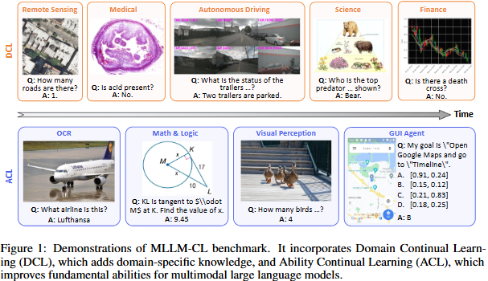
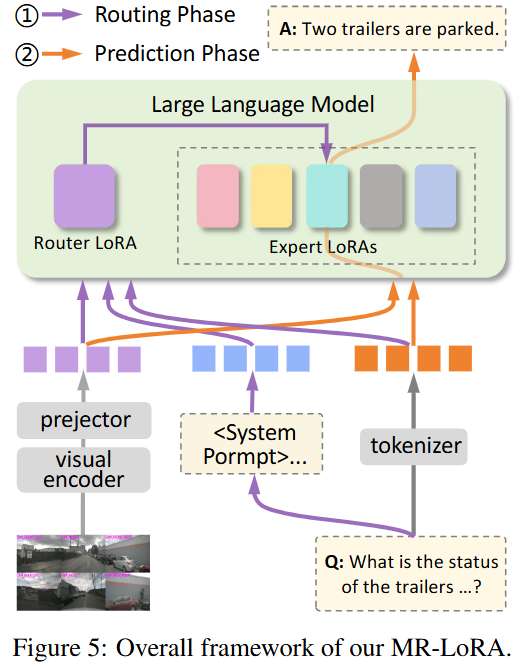

# MLLM-CL: Continual Learning for Multimodal Large Language Models

<!-- @import "[TOC]" {cmd="toc" depthFrom=1 depthTo=6 orderedList=false} -->

<!-- code_chunk_output -->

- [MLLM-CL: Continual Learning for Multimodal Large Language Models](#mllm-cl-continual-learning-for-multimodal-large-language-models)
  - [MLLM-CL Benchmark](#mllm-cl-benchmark)
    - [Domain Continual Learning](#domain-continual-learning)
    - [Ability Continual Learning](#ability-continual-learning)
  - [MR-LoRA](#mr-lora)
  - [Installation](#installation)
  - [Dataset](#dataset)
  - [MR-LoRA training and evaluation](#mr-lora-training-and-evaluation)
  - [LoRA and MoE LoRA training and evaluation](#lora-and-moe-lora-training-and-evaluation)
  - [Citation](#citation)
  - [Acknowledgement](#acknowledgement)
  - [LICENSE](#license)
  - [Contact](#contact)
  - [About us](#about-us)

<!-- /code_chunk_output -->

This is the official repo of MLLM-CL and MR-LoRA. MLLM-CL is a novel benchmark encompassing domain and ability continual learning, where the former focuses on independently and identically distributed (IID) evaluation across evolving mainstream domains, whereas the latter evaluates on non-IID scenarios with emerging model ability. MR-LoRA prevents catastrophic interference through parameter isolation and an MLLM-based routing mechanism. For more details, please refer to: 

**MLLM-CL: Continual Learning for Multimodal Large Language Models** [[paper](https://arxiv.org/abs/2506.05453)].

[‪Hongbo Zhao](https://scholar.google.com/citations?user=Gs22F0UAAAAJ&hl=zh-CN), [Fei Zhu](https://impression2805.github.io/), Rundong Wang, [‪Gaofeng Meng](https://scholar.google.com/citations?hl=zh-CN&user=5hti_r0AAAAJ), [‪Zhaoxiang Zhang‬](https://scholar.google.com/citations?hl=zh-CN&user=qxWfV6cAAAAJ)


## MLLM-CL Benchmark
MLLM-CL is a benchmark for continual learning in multimodal large language models (MLLMs). It consists of two main components: domain continual learning and ability continual learning. The benchmark includes a variety of datasets and tasks to evaluate the performance of MLLMs in evolving scenarios.
### Domain Continual Learning
Continually adding domain knowledge is crucial for constructing a powerful MLLM.

To achieve this goal, we propose domain continual learning and choose five mainstream and common domains: remote sensing, medical, science, autonomous driving and finance.
In domain continual learning, the training set and test set are IID.
### Ability Continual Learning
Domain continual learning assumes that training and test data are IID.
However, achieving IID between training and test sets is often challenging in real-world scenarios.
In ability continual learning, we assume that the training and test data are non-IID.

We select four fundamental abilities for the MLLM to learn sequentially: OCR, math \& logic, visual perception and GUI agent.

## MR-LoRA



Our MR-LoRA performs two-stage inference for a given multimodal input, consisting of a routing phase followed by a prediction phase. In the first stage, the expert selection router is performed to select a domain or ability-specific expert. Then, the selected expert is combined with the pre-trained backbone to output the final response.
## Installation
1. Clone this repository and navigate to CoIN folder
``` 
git clone https://github.com/bjzhb666/MLLM-CL.git
cd MLLM-CL
```
2. Install Package
```
conda env create -f environment.yaml
conda activate mrlora
```

3. Install additional packages for training cases
```
pip install -e ".[train]" -i https://mirrors.tuna.tsinghua.edu.cn/pypi/web/simple
conda install git
pip install flash-attn==2.7.0.post2 --no-build-isolation -i https://mirrors.tuna.tsinghua.edu.cn/pypi/web/simple

huggingface-cli download liuhaotian/llava-v1.5-7b --local-dir checkpoints/LLaVA/Vicuna/llava-7b-v1.5
huggingface-cli download openai/clip-vit-large-patch14-336 --local-dir checkpoints/LLaVA/clip-vit-large-patch14-336

huggingface-cli download liuhaotian/llava-v1.5-mlp2x-336px-pretrain-vicuna-7b-v1.5 --local-dir checkpoints/LLaVA/Vicuna/vicuna-7b-v.15-projector
huggingface-cli download lmsys/vicuna-7b-v1.5  --local-dir checkpoints/LLaVA/Vicuna/vicuna-7b-v1.5
```
4. Prepare the API key
The evaluation of Math & Logic tasks requires the OpenAI API key.
Create an `.env` file in the root directory of the project and add your OpenAI API key:
```
# .env file
# QwenVL APIs
DASHSCOPE_API_KEY=
# Gemini w. Google Cloud Backends
GOOGLE_API_KEY=
# OpenAI API
OPENAI_API_KEY=YOUR_OPENAI_API_KEY
OPENAI_API_BASE=
# StepAI API
STEPAI_API_KEY=
# REKA API
REKA_API_KEY=
# GLMV API
GLMV_API_KEY=
# CongRong API
CW_API_BASE=
CW_API_KEY=
# SenseChat-V API
SENSECHAT_AK=
SENSECHAT_SK=
# Hunyuan-Vision API
HUNYUAN_SECRET_KEY=
HUNYUAN_SECRET_ID=
# LMDeploy API
LMDEPLOY_API_BASE=
EVAL_PROXY=
LMUData=/data/hongbo_zhao/code/VLMEvalKit/LMUData
```

## Dataset
Please download the images of MLLM-CL from huggingface or modelscope: [[huggingface](https://huggingface.co/datasets/Impression2805/MLLM-CL)] or
[[modelscope](https://www.modelscope.cn/datasets/zhaohongbo/MLLM-CL/summary)].

After downloading all of them, organize the data as follows:

Domain Continual Learning Data:
```
├── RS
│   └── images
|   └──train.json
|   └──test.json
├── Med
│   └── images
|   └──train.json
|   └──test.json
├── AD
│   └── images
|   └──train.json
|   └──test.json
├── Fin
│   └── images
│   └── test.sjon
│   └── train.json
├── Sci
|   └── images
|   └──train.json
|   └──test.json
├── task5Router_train20.json
├── task5replay20_train.json
├── num5sample_images20/
```
Ability Continual Learning Data:
```
├── OCR
|   └── images
|   └──train.json
├── OCR_test
|   └── images
|   └──test.json
├── Math
|   └── images
|   └──train.json
├── Math_test
|   └── images
|   └──test.json
├── APP
|   └── images
|   └──train.json
├── APP_test
|   └── images
|   └──test.json
├── VP
|   └── images
|   └──train.json
├── VP_test
|   └── images
|   └──test.json
├── Router_train20.json
├── replay20.json
├── sample_images20/
```

Note: You need to modify the data path in all the scripts to your own path.


## MR-LoRA training and evaluation
First, downloading the pretrained projectors in [LLaVA Model_Zoo](https://github.com/haotian-liu/LLaVA/blob/main/docs/MODEL_ZOO.md).

Setting `pretrain_mm_mlp_adapter` to the projector path.
You could modify the `deepspeed config` to change the deepspeed config.

We provide the scripts of our train order in `scripts/*/Train`.
Note, the `output_dir` of the previous script is the `previous_task_model_path` of the next training process.
Then, you could tune these datasets in your order.

1. Train the expert LoRA independently using the scripts in Train_dom_single folder or Train_ability_single folder. For example
```
bash scripts/LLaVA/Train_dom_single/12_Sci.sh 
```
2. Use the checkpoints of LoRA to get cross-task evaluation results. For example, in domain continual learning, you should test 25 times.
```
bash scripts/LLaVA/Eval_dom/1_eval_remotesensing.sh "" ./checkpoints/LLaVA/CoIN/Sci_llava_lora Sci_rs
bash scripts/LLaVA/Eval_dom/2_eval_medical.sh "" ./checkpoints/LLaVA/CoIN/Sci_llava_lora Sci_pathvqa
bash scripts/LLaVA/Eval_dom/3_eval_drivelm.sh "" ./checkpoints/LLaVA/CoIN/Sci_llava_lora Sci_drivelm
bash scripts/LLaVA/Eval_dom/4_eval_sci.sh "" ./checkpoints/LLaVA/CoIN/Sci_llava_lora Sci_sci
bash scripts/LLaVA/Eval_dom/5_eval_financial.sh "" ./checkpoints/LLaVA/CoIN/Sci_llava_lora Sci_fin
``` 
3. Train the router LoRA
```
bash scripts/LLaVA/Train_dom_single/0_train_router.sh
```
4. Use the router LoRA to select the final results
```
bash scripts/LLaVA/Train_dom/0_eval_router.sh Med pathvqa
bash scripts/LLaVA/Train_dom/0_eval_router.sh AD drivelm
bash scripts/LLaVA/Train_dom/0_eval_router.sh Sci sci
bash scripts/LLaVA/Train_dom/0_eval_router.sh Fin fin
bash scripts/LLaVA/Train_dom/0_eval_router.sh RS rs
```


You can use the checkpoints in [huggingface](https://huggingface.co/Impression2805/MR-LoRA) and [modelscope](https://www.modelscope.cn/collections/MR_LoRA-87d01a9a337944) to test MR-LoRA directly. 

## LoRA and MoE LoRA training and evaluation
We have prepared the scripts to train and evaluate model in `scripts/*/Train_dom`, `scripts/*/Eval_dom`, `scripts/*/Train_ability`, `scripts/*/Eval_ability`.
```
# lora train sequential training
bash scripts/LLaVA/Train_dom/1_RemoteSensing.sh 
bash scripts/LLaVA/Train_dom/2_Medical.sh "" True
bash scripts/LLaVA/Train_dom/3_DriveLM.sh "" True
bash scripts/LLaVA/Train_dom/4_Sci.sh "" True
bash scripts/LLaVA/Train_dom/5_Financial.sh "" True

# MoELoRA training
bash scripts/LLaVA/Train_dom/1_RemoteSensing.sh  Finetune-CL-MoE "" 8
bash scripts/LLaVA/Train_dom/2_Medical.sh  Finetune-CL-MoE True 8
bash scripts/LLaVA/Train_dom/3_DriveLM.sh  Finetune-CL-MoE True 8
bash scripts/LLaVA/Train_dom/4_Sci.sh Finetune-CL-MoE True 8
bash scripts/LLaVA/Train_dom/5_Financial.sh Finetune-CL-MoE True 8
```

Evaluation
```
# lora evaluation
bash scripts/LLaVA/Eval_dom/1_eval_remotesensing.sh  Finetune "./checkpoints/LLaVA/Finetune-CL/FinVis_llava_lora" Fin_rs FineTune-CL-Test
bash scripts/LLaVA/Eval_dom/2_eval_medical.sh Finetune "./checkpoints/LLaVA/Finetune-CL/FinVis_llava_lora" Fin_med FineTune-CL-Test
bash scripts/LLaVA/Eval_dom/3_eval_drivelm.sh Finetune "./checkpoints/LLaVA/Finetune-CL/FinVis_llava_lora" Fin_drivelm FineTune-CL-Test
bash scripts/LLaVA/Eval_dom/4_eval_sci.sh Finetune "./checkpoints/LLaVA/Finetune-CL/FinVis_llava_lora" Fin_sci FineTune-CL-Test
bash scripts/LLaVA/Eval_dom/5_eval_financial.sh Finetune "./checkpoints/LLaVA/Finetune-CL/FinVis_llava_lora" Fin_fin FineTune-CL-Test

# MoELoRA evaluation
bash scripts/LLaVA/Eval_dom/1_eval_remotesensing.sh  Finetune "./checkpoints/LLaVA/Finetune-CL-MoE/FinVis_llava_lora_MOE" Fin_rs FineTune-CL-MoE-Test
bash scripts/LLaVA/Eval_dom/2_eval_medical.sh Finetune "./checkpoints/LLaVA/Finetune-CL-MoE/FinVis_llava_lora_MOE" Fin_med FineTune-CL-MoE-Test
bash scripts/LLaVA/Eval_dom/3_eval_drivelm.sh Finetune "./checkpoints/LLaVA/Finetune-CL-MoE/FinVis_llava_lora_MOE" Fin_drivelm FineTune-CL-MoE-Test
bash scripts/LLaVA/Eval_dom/4_eval_sci.sh Finetune "./checkpoints/LLaVA/Finetune-CL-MoE/FinVis_llava_lora_MOE" Fin_sci FineTune-CL-MoE-Test
bash scripts/LLaVA/Eval_dom/5_eval_financial.sh Finetune "./checkpoints/LLaVA/Finetune-CL-MoE/FinVis_llava_lora_MOE" Fin_fin FineTune-CL-MoE-Test
```

Note: For the GUI agent task in ability continual learning, the final results are in a tsv file and you should submit it to the [evaluation server](https://eval.ai/web/challenges/challenge-page/2328/overview). The evaluation server will return the final results.
## Citation
```
@article{zhao2025mllm,
  title={MLLM-CL: Continual Learning for Multimodal Large Language Models},
  author={Zhao, Hongbo and Zhu, Fei and Wang, Rundong and Meng, Gaofeng and Zhang, Zhaoxiang},
  journal={arXiv preprint arXiv:2506.05453},
  year={2025}
}
```

## Acknowledgement
[LLaVA](https://github.com/haotian-liu/LLaVA): the codebase we built upon, and our base model LLaVA-1.5-7b that has the amazing vision-language capabilities!

[CoIN](https://github.com/zackschen/CoIN), [VLMEvalKit](https://github.com/open-compass/VLMEvalKit): the codebase we built upon.


## LICENSE
```
This project is licensed under the terms of the Apache-2.0 license.
```

## Contact
Please contact us or post an issue if you have any questions.

## About us