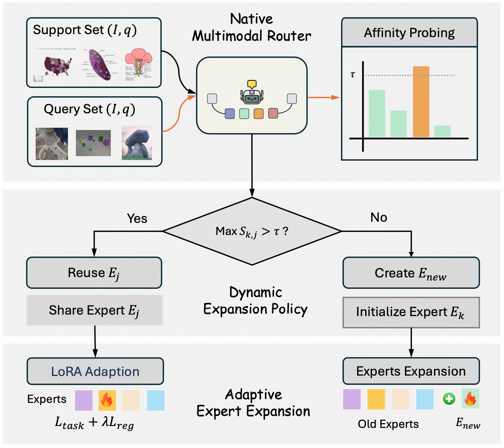

# AdapteX: Adaptive Expert Expansion with a Native Multimodal Router

This directory contains the implementation of **AdapteX**, a continual learning framework for multimodal large language models (MLLMs). AdapteX uses a native multimodal router to adaptively decide whether to create a new expert or reuse an existing one for each incoming task, achieving sub-linear parameter growth while preventing catastrophic forgetting.

## Method Overview

For each new task in the continual learning sequence, AdapteX performs:
1. **Support/Query Sampling** -- Sample support set and query set from task data
2. **Router Training** -- Train the native multimodal router on combined support sets
3. **Affinity Probing** -- Use the router to compute bi-directional affinity scores between the new task and existing experts
4. **Structural Decision** -- If max affinity > threshold $\tau$, reuse the matched expert; otherwise, expand with a new expert
5. **Expert Training** -- Train the selected expert LoRA, applying EWC regularization when reusing

## Code Structure

```
adaptex/
├── run_adaptex.py        # Main orchestration pipeline
├── affinity_probe.py     # Router-based affinity probing (bi-directional misclassification)
├── ewc.py                # Elastic Weight Consolidation (Fisher computation & regularization)
├── ewc_trainer.py        # LLaVA trainer with EWC loss
├── train_ewc.py          # Training entry point with EWC support
├── prompt_manager.py     # Dynamic router prompt management (expand/reuse)
├── router_data.py        # Support/query set preparation and router training data
├── eval_adaptex.py       # Two-stage inference evaluation
├── configs/
│   ├── adaptex_dcl_llava.json   # Config for Domain Continual Learning
│   └── adaptex_acl_llava.json   # Config for Ability Continual Learning
└── scripts/
    ├── run_dcl.sh         # Run DCL pipeline
    ├── run_acl.sh         # Run ACL pipeline
    └── eval_adaptex.sh    # Evaluate with router-based expert selection
```

## Installation

AdapteX is built on top of the [MLLM-CL](https://github.com/bjzhb666/MLLM-CL) codebase.

```bash
git clone https://github.com/bjzhb666/MLLM-CL.git
cd MLLM-CL
pip install -e ".[train]"
pip install flash-attn==2.7.0.post2 --no-build-isolation
```

## Quick Start

### 1. Prepare Models and Data

Download the required models:
```bash
huggingface-cli download liuhaotian/llava-v1.5-7b --local-dir checkpoints/llava-v1.5-7b
huggingface-cli download openai/clip-vit-large-patch14-336 --local-dir checkpoints/clip-vit-large-patch14-336
```

Download the MLLM-CL dataset from [HuggingFace](https://huggingface.co/datasets/MLLM-CL/MLLM-CL) or [ModelScope](https://www.modelscope.cn/datasets/MLLM-CL/MLLM-CL).

### 2. Edit Config

Update the paths in the config file (e.g., `adaptex/configs/adaptex_dcl_llava.json`):
- `base_model`: path to LLaVA-v1.5-7b
- `mm_projector`: path to mm_projector.bin
- `vision_tower`: path to CLIP ViT
- `data_base_dir`: path to dataset root
- `train_path` / `image_folder` for each task

### 3. Run the Pipeline

**Domain Continual Learning (DCL):**
```bash
bash adaptex/scripts/run_dcl.sh
```

**Ability Continual Learning (ACL):**
```bash
bash adaptex/scripts/run_acl.sh
```

### 4. Evaluate

```bash
# Evaluate on a specific dataset (e.g., RS in DCL)
bash adaptex/scripts/eval_adaptex.sh DCL RS

# Evaluate on ACL
bash adaptex/scripts/eval_adaptex.sh ACL OCR_test
```


## Acknowledgement

- [LLaVA](https://github.com/haotian-liu/LLaVA): base model and codebase
- [MLLM-CL](https://github.com/bjzhb666/MLLM-CL): benchmark and evaluation framework
